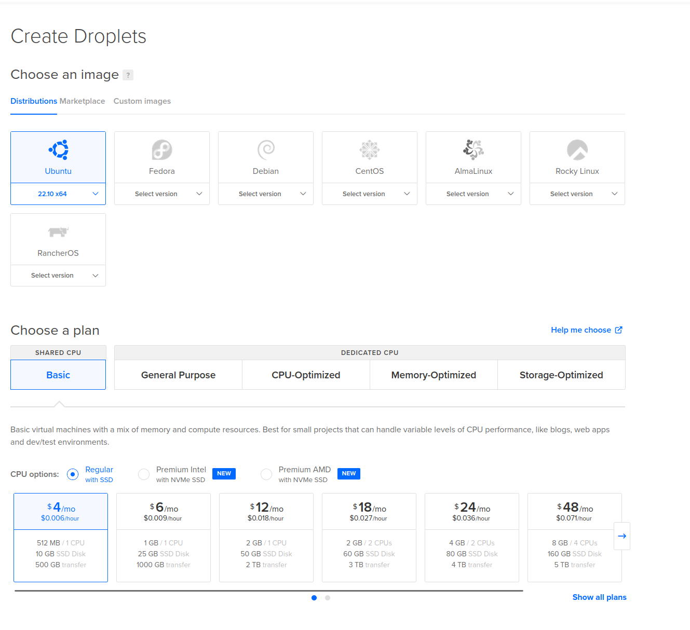
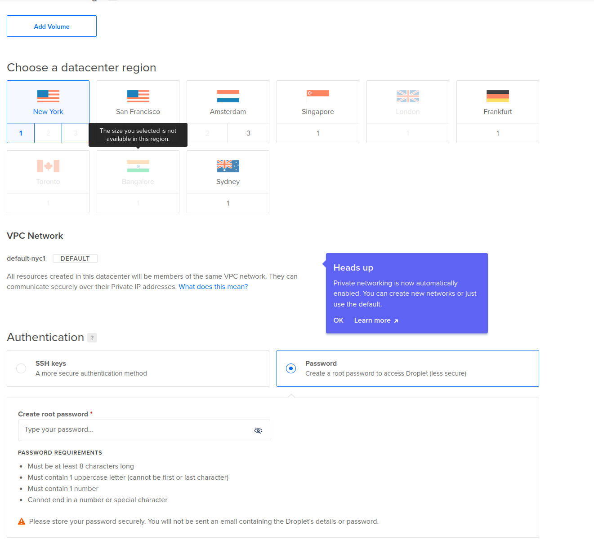

# Deployment-Workshop

workshop notes for how to create and deploy a custom [nodejs](https://nodejs.org/en/) server (for artists)

## Example Servers

the **examples-servers** directory contains a few different types of demo node.js servers.
- **[nodejs-web-server](example-servers/nodejs-web-server)** is an example of a static web server created in nodejs (without any libraries or frameworks)
- **[nodejs-bbs-server](example-servers/nodejs-bbs-server)** is an example of creating an old-school BBS ([Bulletin Board System](http://www.bbsdocumentary.com/)) server
- **[express-static-server](example-servers/express-static-server)** is an example of a static web server created using the [express.js](https://expressjs.com/) framework (this is the type of server we produced in the workshop)
- **[express-REST-API-server](example-servers/express-REST-API-server)** is an example of a static web server created with express.js which also includes a custom REST API
- **[express-sockets-server](example-servers/express-sockets-server)** is an example of a static web server created with express.js which also has realtime sockets communication using the [socket.io](https://socket.io/) library


## Deployment Process

### 1. create a "droplet" on digital ocean

Create a [Digital Ocean](https://cloud.digitalocean.com/) account (consider signing up for the
[GitHub Student Developer Pack](https://education.github.com/pack) to get $200 of credit on Digital Ocean).

Create a new "droplet" on digital ocean (which is what they call a virtual machine), this is a computer in a data center that you can use for whatever you want (we'll be using it to launch our custom server, but you can use this computer for any number of additional things). During our workshop we created a droplet that has **Ubunutu** linux installed as the operating system, **512MB of RAM, 10GB of SSD Storage and 500 GB transfer** (the cheapest tier, $4/month), in a **New York Data Center** with **password** mode of authentication.





**NOTE** you don't *need* to use Digital Ocean, you can rent a computer in a data center using any number of other services (AWS, Azure, Linode, etc)

### 2. log into your computer with `ssh`

Once the droplet is created they'll show you the computer's IP address (it's location on the Internet), we'll login as the "root" user using [ssh](https://www.ssh.com/academy/ssh)

```
ssh root@255.255.255.255
```
*replace 255.255.255.255 with your IP address*

### 3. install nodejs

The nodejs website has a section for [Installing Node.js via package manager](https://nodejs.org/en/download/package-manager/), under the section for Ubunutu it links to [Node.js binary distributions](https://github.com/nodesource/distributions/blob/master/README.md) which explains we need to run the following command in our droplet's terminal to install nodejs:

```
curl -fsSL https://deb.nodesource.com/setup_19.x | bash - &&\
apt-get install -y nodejs
```

### 4. clone your repository

once you have nodejs installed, let's clone our server from our github repository:

```
git clone https://github.com/your-username/project-name
```

then navigate into your cloned repository
```
cd project-name
```
*replacing "project-name" with the name of your repo*

once in there, install all of your nodejs server/project's dependencies by running

```
npm install
```

at this point you can test to make sure your server is working by running `node server.js` and then visiting your IP address in a browser (assuming your running your server on port 80, otherwise you'll need to add the port number, for ex: `255.255.255.255:8000`). quit the server by running `Ctrl+C`

### 5. setting up `pm2`

rather than running our serer manually, we're going to want to setup a "service", which will ensure that our server is always running (even if it crashes or if we restart the computer), in order to do this we'll be using [pm2](https://pm2.io/)

first we'll need to install pm2:

```
npm install pm2@latest -g
```

then we'll add our server to the list of processing pm2 is managing:

```
pm2 start server.js
```

then we'll make sure pm2 is always running by adding it to systemd:

```
pm2 startup systemd
```

then we'll save that
```
pm2 save
```

You now have your server running as a "service" on your machine, pm2 will make sure your server is always running. You can add other servers or nodejs scripts that you write and deploy on this machine using pm2 as well, simply run `pm2 add script-name.js`. You can stop your server (or any other process) by running `pm2 stop server` and then restart it by running `pm2 start server` or even `pm2 restart server`

## 6. setting up our firewall `ufw`

before we run our firewall we're going to want to open up any ports we don't want blocked. for example:

- `ufw allow ssh` to open up port 22, so we can ssh into our computer
- `ufw allow ftp` to open up port 20 or 21 so we can use an FTP client like [cyberduck](https://cyberduck.io/) or [filezilla](https://filezilla-project.org/) to upload/download files to your computer.
- `ufw allow www` to open up port 80 so that other folks can send requests to our server (assuming we're running our server on port 80)
- `ufw allow https` to open up port 443 if you want to use encrypted SSL connections (https) to your server

once we've specified which ports we want to open, we can run our firewall `ufw enable`. you can check the status of the firewall by running `ufw status` at anytime, you can also turn off the firewall by running `ufw disable`


## 7. Domain Names + HTTPS

Because we never purchased a domain name for our server, we never setup SSL certificates to establish https connections. But if we did decide we needed that for our project, you could register a domain name with any registrar (like [namecheap](https://www.namecheap.com/) for example) then point that domain to the [Digital Ocean name servers](https://docs.digitalocean.com/tutorials/dns-registrars/) and then on your digital ocean account [create a domain DNS record](https://docs.digitalocean.com/products/networking/dns/how-to/manage-records/) for that domain name which points to your droplet

once you've done that you can use the EFF's [certbot](https://certbot.eff.org/) to create SSL certificates to establish HTTPS connections
